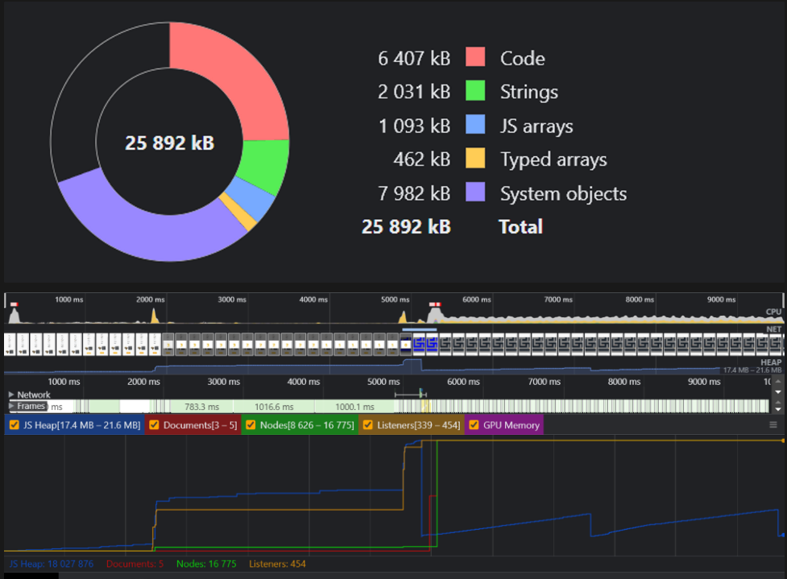
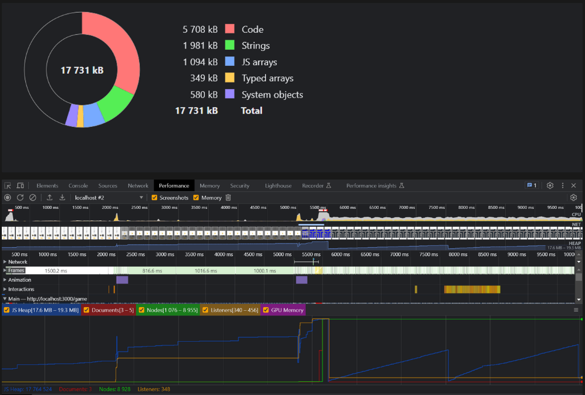

# Как проходил процесс оптимизации?

## Шаги

1. Замерка производительности приложения при помощи: React Profiler и dev-консоли
2. Выявление утечек
3. Оптимизация приложения при помощи хуков: useCallback(), useMemo(). И React.Memo
4. Повторная замерка, чтобы удостовериться в улучшении проивзодительности

## Что было до?

До оптимизации приложение показывало такую производительность и использование памяти:

#### React Profiler -

actualDuration 0.10000002384185791

baseDuration 0

startTime 8036.799999952316

commitTime 8037.200000047684

#### dev-консоль

## Что стало после?

После оптимизации приложение показывало такие производительность и использование памяти:

#### React Profiler -

actualDuration 0.2999999523162842

baseDuration 0.10000002384185791

startTime 6733.600000023842

commitTime 6734.100000023842

#### dev-консоль

## Изменения

| Критерий       | До                  | После               | Изменение в % |
|----------------|---------------------|---------------------|---------------|
| actualDuration | 0.10000002384185791 | 0.2999999523162842  | 200.00%       |
| baseDuration   | 0                   | 0.10000002384185791 | N/A           |
| startTime      | 8036.799999952316   | 6733.600000023842   | -16.17%       |
| commitTime     | 8037.200000047684   | 6734.100000023842   | -16.21%       |
| memory         | 25892               | 17731               | -31.54%       |
| JS Heap        | 18027876            | 17264524            | -4.24%        |
| Documents      | 5                   | 3                   | -40.00%       |
| NodeJs         | 16775               | 8935                | -46.77%       |
| Listeners      | 339-454             | 348                 | -2.11%        |

Из данных React Profiler видно, что использование `useCallback` привело к увеличению фактического времени 
(`actualDuration`), что, объясняется некоторыми накладными расходами, связанными с мемоизацией колбэков.
Однако, в то же время, оно уменьшило базовое время (`baseDuration`), что говорит о том, что была произведена 
оптимизация.

Изменения в `startTime` и `commitTime` показывают, что компонент также монтируется (или обновляется) быстрее после 
использования `useCallback`.

В целом, использование `useCallback` в данном случае выглядит как успешная оптимизация, хотя она привела к 
небольшому увеличению фактического времени монтирования компонента.

Из данных dev-консоли видно, что оптимизация приложения привела к снижению потребления памяти, количество 
документов и слушателей событий было сокращено.